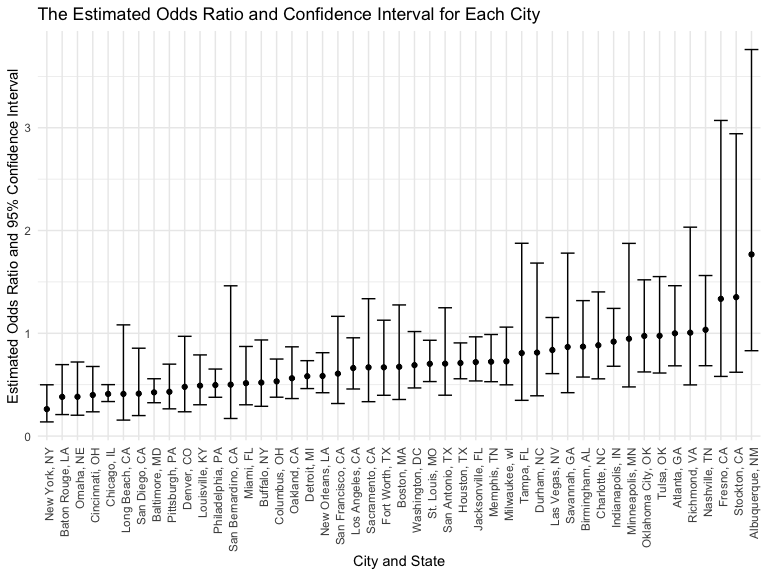
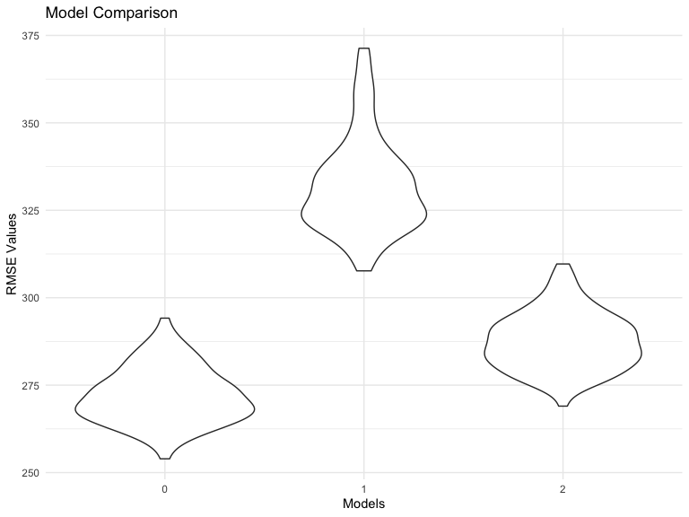

p8105_HW6_yl5220
================
2022-12-03

# Problem 1

``` r
# Create a city_state variable (e.g. “Baltimore, MD”), and a binary variable indicating whether the homicide is solved. Omit cities Dallas, TX; Phoenix, AZ; and Kansas City, MO – these don’t report victim race. Also omit Tulsa, AL – this is a data entry mistake. For this problem, limit your analysis those for whom victim_race is white or black. Be sure that victim_age is numeric.

# unsolved homicides (those for which the disposition is “Closed without arrest” or “Open/No arrest”).

homicides_data = 
  read_csv("./data/homicide-data.csv") %>% 
  janitor::clean_names() %>% 
  mutate(city_state = str_c(city, ", ", state)) %>% 
  relocate(city_state, .after = reported_date) %>% 
  mutate(homicide = case_when(disposition == "Closed without arrest"~ 0,
                              disposition == "Open/No arrest" ~ 0,
                              disposition == "Closed by arrest" ~ 1))%>% 
  mutate(homicide = as.integer(homicide)) %>% 
  filter(city_state != "Dallas, TX",
         city_state != "Phoenix, AZ",
         city_state != "Kansas City, MO",
         city_state != "Tulsa, AL",
         victim_race == "White" | victim_race == "Black") %>% 
  mutate(victim_age = as.numeric(victim_age))
```

    ## Rows: 52179 Columns: 12
    ## ── Column specification ────────────────────────────────────────────────────────
    ## Delimiter: ","
    ## chr (9): uid, victim_last, victim_first, victim_race, victim_age, victim_sex...
    ## dbl (3): reported_date, lat, lon
    ## 
    ## ℹ Use `spec()` to retrieve the full column specification for this data.
    ## ℹ Specify the column types or set `show_col_types = FALSE` to quiet this message.

``` r
homicides_data
```

    ## # A tibble: 39,693 × 14
    ##    uid       repor…¹ city_…² victi…³ victi…⁴ victi…⁵ victi…⁶ victi…⁷ city  state
    ##    <chr>       <dbl> <chr>   <chr>   <chr>   <chr>     <dbl> <chr>   <chr> <chr>
    ##  1 Alb-0000…  2.01e7 Albuqu… SATTER… VIVIANA White        15 Female  Albu… NM   
    ##  2 Alb-0000…  2.01e7 Albuqu… MULA    VIVIAN  White        72 Female  Albu… NM   
    ##  3 Alb-0000…  2.01e7 Albuqu… BOOK    GERALD… White        91 Female  Albu… NM   
    ##  4 Alb-0000…  2.01e7 Albuqu… MARTIN… GUSTAVO White        56 Male    Albu… NM   
    ##  5 Alb-0000…  2.01e7 Albuqu… LUJAN   KEVIN   White        NA Male    Albu… NM   
    ##  6 Alb-0000…  2.01e7 Albuqu… GRAY    STEFAN… White        43 Female  Albu… NM   
    ##  7 Alb-0000…  2.01e7 Albuqu… DAVID   LARRY   White        52 Male    Albu… NM   
    ##  8 Alb-0000…  2.01e7 Albuqu… BRITO   ELIZAB… White        22 Female  Albu… NM   
    ##  9 Alb-0000…  2.01e7 Albuqu… KING    TEVION  Black        15 Male    Albu… NM   
    ## 10 Alb-0000…  2.01e7 Albuqu… BOYKIN  CEDRIC  Black        25 Male    Albu… NM   
    ## # … with 39,683 more rows, 4 more variables: lat <dbl>, lon <dbl>,
    ## #   disposition <chr>, homicide <int>, and abbreviated variable names
    ## #   ¹​reported_date, ²​city_state, ³​victim_last, ⁴​victim_first, ⁵​victim_race,
    ## #   ⁶​victim_age, ⁷​victim_sex

``` r
typeof(homicides_data$homicide)
```

    ## [1] "integer"

``` r
#For the city of Baltimore, MD, use the glm function to fit a logistic regression with resolved vs unresolved as the outcome and victim age, sex and race as predictors. Save the output of glm as an R object; apply the broom::tidy to this object; and obtain the estimate and confidence interval of the adjusted odds ratio for solving homicides comparing male victims to female victims keeping all other variables fixed.

baltimore_data = 
  homicides_data %>% 
  filter(city_state == "Baltimore, MD") %>% 
  select(victim_age, victim_sex, victim_race, homicide)
baltimore_data
```

    ## # A tibble: 2,753 × 4
    ##    victim_age victim_sex victim_race homicide
    ##         <dbl> <chr>      <chr>          <int>
    ##  1         17 Male       Black              0
    ##  2         26 Male       Black              0
    ##  3         21 Male       Black              0
    ##  4         61 Male       White              1
    ##  5         46 Male       Black              1
    ##  6         27 Male       Black              1
    ##  7         21 Male       Black              1
    ##  8         16 Male       Black              1
    ##  9         21 Male       Black              1
    ## 10         44 Female     Black              1
    ## # … with 2,743 more rows

``` r
baltimore_reg = 
  baltimore_data %>% 
  glm(homicide ~ victim_age + victim_sex + victim_race, data = ., family = binomial) 
baltimore_reg
```

    ## 
    ## Call:  glm(formula = homicide ~ victim_age + victim_sex + victim_race, 
    ##     family = binomial, data = .)
    ## 
    ## Coefficients:
    ##      (Intercept)        victim_age    victim_sexMale  victim_raceWhite  
    ##         0.309981         -0.006727         -0.854463          0.841756  
    ## 
    ## Degrees of Freedom: 2752 Total (i.e. Null);  2749 Residual
    ## Null Deviance:       3568 
    ## Residual Deviance: 3493  AIC: 3501

``` r
baltimore_reg %>% 
  broom::tidy() %>% 
  filter(term == "victim_sexMale") %>%
  mutate(OR = exp(estimate),
         conf_low = exp(estimate - 1.96*std.error),
         conf_high = exp(estimate + 1.96*std.error)
         ) %>% 
  select(term, estimate, OR, conf_low, conf_high)
```

    ## # A tibble: 1 × 5
    ##   term           estimate    OR conf_low conf_high
    ##   <chr>             <dbl> <dbl>    <dbl>     <dbl>
    ## 1 victim_sexMale   -0.854 0.426    0.325     0.558

``` r
# Now run glm for each of the cities in your dataset, and extract the adjusted odds ratio (and CI) for solving homicides comparing male victims to female victims. Do this within a “tidy” pipeline, making use of purrr::map, list columns, and unnest as necessary to create a dataframe with estimated ORs and CIs for each city.

cities_glm = function(citystate_name) {
  city_glm_data = 
    homicides_data %>% 
    filter(city_state == citystate_name) %>% 
    group_by(city_state) 
  
  city_glm = 
    city_glm_data %>% 
    glm(homicide ~ victim_age + victim_sex + victim_race, data = ., family = binomial)
  
  city_glm_result = 
    city_glm %>% 
    broom::tidy() %>% 
    filter(term == "victim_sexMale") %>%
    mutate(OR = exp(estimate), 
           conf_low = exp(estimate - 1.96*std.error),
           conf_high = exp(estimate + 1.96*std.error)) %>%
    select(term, estimate, OR, conf_low, conf_high)
    
  city_glm_result
  
  }

city_state_name = unique(homicides_data$city_state)
city_glm_test = 
  expand_grid(city_state = city_state_name) %>% 
  mutate(test_results = map(city_state, cities_glm)) %>% 
  unnest(test_results) 

city_glm_test
```

    ## # A tibble: 47 × 6
    ##    city_state      term             estimate    OR conf_low conf_high
    ##    <chr>           <chr>               <dbl> <dbl>    <dbl>     <dbl>
    ##  1 Albuquerque, NM victim_sexMale  0.570     1.77     0.831     3.76 
    ##  2 Atlanta, GA     victim_sexMale  0.0000771 1.00     0.684     1.46 
    ##  3 Baltimore, MD   victim_sexMale -0.854     0.426    0.325     0.558
    ##  4 Baton Rouge, LA victim_sexMale -0.964     0.381    0.209     0.695
    ##  5 Birmingham, AL  victim_sexMale -0.139     0.870    0.574     1.32 
    ##  6 Boston, MA      victim_sexMale -0.395     0.674    0.356     1.28 
    ##  7 Buffalo, NY     victim_sexMale -0.653     0.521    0.290     0.935
    ##  8 Charlotte, NC   victim_sexMale -0.123     0.884    0.557     1.40 
    ##  9 Chicago, IL     victim_sexMale -0.891     0.410    0.336     0.501
    ## 10 Cincinnati, OH  victim_sexMale -0.917     0.400    0.236     0.677
    ## # … with 37 more rows

``` r
# Create a plot that shows the estimated ORs and CIs for each city. Organize cities according to estimated OR, and comment on the plot.

city_glm_test %>% 
  mutate(city_state = fct_reorder(city_state, OR)) %>% 
  ggplot(aes(x = city_state, y = OR)) +
  geom_point() +
  labs(
        title = "The Estimated Odds Ratio and Confidence Interval for Each City",
        x = "City and State",
        y = "Estimated Odds Ratio and 95% Confidence Interval"
            ) +
  geom_errorbar(aes(ymin = conf_low, ymax = conf_high)) +
  theme(axis.text.x = element_text(angle = 90, vjust = 0.8, hjust=1)) +
  theme(legend.position = "bottom") 
```


From the plot, we can see that Albuquerque, NM has the biggest
confidence interval, the next two cities that have a larger confidence
interval than others are Stockton, CA and Fresno, CA, and most cities
have their estimated odds ratio less than 1, meaning that in these
cities the solving homicides of male victims is less than that of female
victims.

# Problem 3

``` r
# Load and clean the data for regression analysis (i.e. convert numeric to factor where appropriate, check for missing data, etc.).

bw_data = 
  read_csv("./data/birthweight.csv")  
```

    ## Rows: 4342 Columns: 20
    ## ── Column specification ────────────────────────────────────────────────────────
    ## Delimiter: ","
    ## dbl (20): babysex, bhead, blength, bwt, delwt, fincome, frace, gaweeks, malf...
    ## 
    ## ℹ Use `spec()` to retrieve the full column specification for this data.
    ## ℹ Specify the column types or set `show_col_types = FALSE` to quiet this message.

``` r
sum(is.na(bw_data))
```

    ## [1] 0

``` r
bw_data_1 =
  bw_data %>% 
  janitor::clean_names() %>% 
  mutate(babysex = case_when(babysex == 1 ~ "male",
                             babysex == 2 ~ "female"),
         frace = case_when(frace == 1 ~ "White",
                           frace == 2 ~ "Black",
                           frace == 3 ~ "Asian",
                           frace == 4 ~ "Puerto Rican",
                           frace == 8 ~ "Other",
                           frace == 9 ~ "Unknown"),
         malform = case_when(malform == 0 ~ "absent",
                             malform == 1 ~ "present"),
         mrace = case_when(mrace == 1 ~ "White",
                           mrace == 2 ~ "Black",
                           mrace == 3 ~ "Asian",
                           mrace == 4 ~ "Puerto Rican",
                           mrace == 8 ~ "Other")
         ) %>% 
  relocate(bwt)
 
typeof(bw_data$babysex)
```

    ## [1] "double"

``` r
typeof(bw_data$frace)
```

    ## [1] "double"

``` r
typeof(bw_data$mrace)
```

    ## [1] "double"

``` r
typeof(bw_data$malform)
```

    ## [1] "double"

``` r
# Propose a regression model for birthweight. This model may be based on a hypothesized structure for the factors that underly birthweight, on a data-driven model-building process, or a combination of the two. Describe your modeling process and show a plot of model residuals against fitted values – use add_predictions and add_residuals in making this plot.


# fit regression using all predictors 
mult.fit = lm(bwt~ ., data = bw_data_1) 
summary(mult.fit)
```

    ## 
    ## Call:
    ## lm(formula = bwt ~ ., data = bw_data_1)
    ## 
    ## Residuals:
    ##      Min       1Q   Median       3Q      Max 
    ## -1097.68  -184.86    -3.33   173.09  2344.15 
    ## 
    ## Coefficients: (3 not defined because of singularities)
    ##                     Estimate Std. Error t value Pr(>|t|)    
    ## (Intercept)       -6306.8346   659.2640  -9.566  < 2e-16 ***
    ## babysexmale         -28.7073     8.4652  -3.391 0.000702 ***
    ## bhead               130.7781     3.4523  37.881  < 2e-16 ***
    ## blength              74.9536     2.0217  37.075  < 2e-16 ***
    ## delwt                 4.1007     0.3948  10.386  < 2e-16 ***
    ## fincome               0.2898     0.1795   1.614 0.106551    
    ## fraceBlack           -6.9048    78.8349  -0.088 0.930210    
    ## fraceOther          -16.9392    97.5932  -0.174 0.862212    
    ## fracePuerto Rican   -68.2323    78.4692  -0.870 0.384599    
    ## fraceWhite          -21.2361    69.2960  -0.306 0.759273    
    ## gaweeks              11.5494     1.4654   7.882 4.06e-15 ***
    ## malformpresent        9.7650    70.6259   0.138 0.890039    
    ## menarche             -3.5508     2.8951  -1.226 0.220083    
    ## mheight               9.7874    10.3116   0.949 0.342588    
    ## momage                0.7593     1.2221   0.621 0.534418    
    ## mraceBlack          -60.0488    80.9532  -0.742 0.458266    
    ## mracePuerto Rican    34.9079    80.9481   0.431 0.666317    
    ## mraceWhite           91.3866    71.9190   1.271 0.203908    
    ## parity               95.5411    40.4793   2.360 0.018307 *  
    ## pnumlbw                   NA         NA      NA       NA    
    ## pnumsga                   NA         NA      NA       NA    
    ## ppbmi                 4.3538    14.8913   0.292 0.770017    
    ## ppwt                 -3.4716     2.6121  -1.329 0.183913    
    ## smoken               -4.8544     0.5871  -8.269  < 2e-16 ***
    ## wtgain                    NA         NA      NA       NA    
    ## ---
    ## Signif. codes:  0 '***' 0.001 '**' 0.01 '*' 0.05 '.' 0.1 ' ' 1
    ## 
    ## Residual standard error: 272.5 on 4320 degrees of freedom
    ## Multiple R-squared:  0.7183, Adjusted R-squared:  0.717 
    ## F-statistic: 524.6 on 21 and 4320 DF,  p-value: < 2.2e-16

``` r
step(mult.fit, direction='backward')
```

    ## Start:  AIC=48717.83
    ## bwt ~ babysex + bhead + blength + delwt + fincome + frace + gaweeks + 
    ##     malform + menarche + mheight + momage + mrace + parity + 
    ##     pnumlbw + pnumsga + ppbmi + ppwt + smoken + wtgain
    ## 
    ## 
    ## Step:  AIC=48717.83
    ## bwt ~ babysex + bhead + blength + delwt + fincome + frace + gaweeks + 
    ##     malform + menarche + mheight + momage + mrace + parity + 
    ##     pnumlbw + pnumsga + ppbmi + ppwt + smoken
    ## 
    ## 
    ## Step:  AIC=48717.83
    ## bwt ~ babysex + bhead + blength + delwt + fincome + frace + gaweeks + 
    ##     malform + menarche + mheight + momage + mrace + parity + 
    ##     pnumlbw + ppbmi + ppwt + smoken
    ## 
    ## 
    ## Step:  AIC=48717.83
    ## bwt ~ babysex + bhead + blength + delwt + fincome + frace + gaweeks + 
    ##     malform + menarche + mheight + momage + mrace + parity + 
    ##     ppbmi + ppwt + smoken
    ## 
    ##            Df Sum of Sq       RSS   AIC
    ## - frace     4    124365 320848704 48712
    ## - malform   1      1419 320725757 48716
    ## - ppbmi     1      6346 320730684 48716
    ## - momage    1     28661 320752999 48716
    ## - mheight   1     66886 320791224 48717
    ## - menarche  1    111679 320836018 48717
    ## - ppwt      1    131132 320855470 48718
    ## <none>                  320724338 48718
    ## - fincome   1    193454 320917792 48718
    ## - parity    1    413584 321137922 48721
    ## - mrace     3    868321 321592659 48724
    ## - babysex   1    853796 321578134 48727
    ## - gaweeks   1   4611823 325336161 48778
    ## - smoken    1   5076393 325800732 48784
    ## - delwt     1   8008891 328733230 48823
    ## - blength   1 102050296 422774634 49915
    ## - bhead     1 106535716 427260054 49961
    ## 
    ## Step:  AIC=48711.51
    ## bwt ~ babysex + bhead + blength + delwt + fincome + gaweeks + 
    ##     malform + menarche + mheight + momage + mrace + parity + 
    ##     ppbmi + ppwt + smoken
    ## 
    ##            Df Sum of Sq       RSS   AIC
    ## - malform   1      1447 320850151 48710
    ## - ppbmi     1      6975 320855679 48710
    ## - momage    1     28379 320877083 48710
    ## - mheight   1     69502 320918206 48710
    ## - menarche  1    115708 320964411 48711
    ## - ppwt      1    133961 320982665 48711
    ## <none>                  320848704 48712
    ## - fincome   1    194405 321043108 48712
    ## - parity    1    414687 321263390 48715
    ## - babysex   1    852133 321700837 48721
    ## - gaweeks   1   4625208 325473911 48772
    ## - smoken    1   5036389 325885093 48777
    ## - delwt     1   8013099 328861802 48817
    ## - mrace     3  13540415 334389119 48885
    ## - blength   1 101995688 422844392 49908
    ## - bhead     1 106662962 427511666 49956
    ## 
    ## Step:  AIC=48709.53
    ## bwt ~ babysex + bhead + blength + delwt + fincome + gaweeks + 
    ##     menarche + mheight + momage + mrace + parity + ppbmi + ppwt + 
    ##     smoken
    ## 
    ##            Df Sum of Sq       RSS   AIC
    ## - ppbmi     1      6928 320857079 48708
    ## - momage    1     28660 320878811 48708
    ## - mheight   1     69320 320919470 48708
    ## - menarche  1    116027 320966177 48709
    ## - ppwt      1    133894 320984044 48709
    ## <none>                  320850151 48710
    ## - fincome   1    193784 321043934 48710
    ## - parity    1    414482 321264633 48713
    ## - babysex   1    851279 321701430 48719
    ## - gaweeks   1   4624003 325474154 48770
    ## - smoken    1   5035195 325885346 48775
    ## - delwt     1   8029079 328879230 48815
    ## - mrace     3  13553320 334403471 48883
    ## - blength   1 102009225 422859375 49906
    ## - bhead     1 106675331 427525481 49954
    ## 
    ## Step:  AIC=48707.63
    ## bwt ~ babysex + bhead + blength + delwt + fincome + gaweeks + 
    ##     menarche + mheight + momage + mrace + parity + ppwt + smoken
    ## 
    ##            Df Sum of Sq       RSS   AIC
    ## - momage    1     29211 320886290 48706
    ## - menarche  1    117635 320974714 48707
    ## <none>                  320857079 48708
    ## - fincome   1    195199 321052278 48708
    ## - parity    1    412984 321270064 48711
    ## - babysex   1    850020 321707099 48717
    ## - mheight   1   1078673 321935752 48720
    ## - ppwt      1   2934023 323791103 48745
    ## - gaweeks   1   4621504 325478583 48768
    ## - smoken    1   5039368 325896447 48773
    ## - delwt     1   8024939 328882018 48813
    ## - mrace     3  13551444 334408523 48881
    ## - blength   1 102018559 422875638 49904
    ## - bhead     1 106821342 427678421 49953
    ## 
    ## Step:  AIC=48706.02
    ## bwt ~ babysex + bhead + blength + delwt + fincome + gaweeks + 
    ##     menarche + mheight + mrace + parity + ppwt + smoken
    ## 
    ##            Df Sum of Sq       RSS   AIC
    ## - menarche  1    100121 320986412 48705
    ## <none>                  320886290 48706
    ## - fincome   1    240800 321127090 48707
    ## - parity    1    431433 321317724 48710
    ## - babysex   1    841278 321727568 48715
    ## - mheight   1   1076739 321963029 48719
    ## - ppwt      1   2913653 323799943 48743
    ## - gaweeks   1   4676469 325562760 48767
    ## - smoken    1   5045104 325931394 48772
    ## - delwt     1   8000672 328886962 48811
    ## - mrace     3  14667730 335554021 48894
    ## - blength   1 101990556 422876847 49902
    ## - bhead     1 106864308 427750598 49952
    ## 
    ## Step:  AIC=48705.38
    ## bwt ~ babysex + bhead + blength + delwt + fincome + gaweeks + 
    ##     mheight + mrace + parity + ppwt + smoken
    ## 
    ##           Df Sum of Sq       RSS   AIC
    ## <none>                 320986412 48705
    ## - fincome  1    245637 321232048 48707
    ## - parity   1    422770 321409181 48709
    ## - babysex  1    846134 321832545 48715
    ## - mheight  1   1012240 321998651 48717
    ## - ppwt     1   2907049 323893461 48743
    ## - gaweeks  1   4662501 325648912 48766
    ## - smoken   1   5073849 326060260 48771
    ## - delwt    1   8137459 329123871 48812
    ## - mrace    3  14683609 335670021 48894
    ## - blength  1 102191779 423178191 49903
    ## - bhead    1 106779754 427766166 49950

    ## 
    ## Call:
    ## lm(formula = bwt ~ babysex + bhead + blength + delwt + fincome + 
    ##     gaweeks + mheight + mrace + parity + ppwt + smoken, data = bw_data_1)
    ## 
    ## Coefficients:
    ##       (Intercept)        babysexmale              bhead            blength  
    ##         -6145.151            -28.558            130.777             74.947  
    ##             delwt            fincome            gaweeks            mheight  
    ##             4.107              0.318             11.592              6.594  
    ##        mraceBlack  mracePuerto Rican         mraceWhite             parity  
    ##           -63.906            -25.791             74.887             96.305  
    ##              ppwt             smoken  
    ##            -2.676             -4.843

``` r
backward_model = lm(formula = bwt ~ babysex + bhead + blength + delwt + fincome + 
    gaweeks + mheight + mrace + parity + ppwt + smoken, data = bw_data_1)
backward_model
```

    ## 
    ## Call:
    ## lm(formula = bwt ~ babysex + bhead + blength + delwt + fincome + 
    ##     gaweeks + mheight + mrace + parity + ppwt + smoken, data = bw_data_1)
    ## 
    ## Coefficients:
    ##       (Intercept)        babysexmale              bhead            blength  
    ##         -6145.151            -28.558            130.777             74.947  
    ##             delwt            fincome            gaweeks            mheight  
    ##             4.107              0.318             11.592              6.594  
    ##        mraceBlack  mracePuerto Rican         mraceWhite             parity  
    ##           -63.906            -25.791             74.887             96.305  
    ##              ppwt             smoken  
    ##            -2.676             -4.843

``` r
backward_model %>% broom::tidy()
```

    ## # A tibble: 14 × 5
    ##    term               estimate std.error statistic   p.value
    ##    <chr>                 <dbl>     <dbl>     <dbl>     <dbl>
    ##  1 (Intercept)       -6145.      142.      -43.3   0        
    ##  2 babysexmale         -28.6       8.45     -3.38  7.37e-  4
    ##  3 bhead               131.        3.45     37.9   3.10e-272
    ##  4 blength              74.9       2.02     37.1   4.29e-262
    ##  5 delwt                 4.11      0.392    10.5   2.26e- 25
    ##  6 fincome               0.318     0.175     1.82  6.88e-  2
    ##  7 gaweeks              11.6       1.46      7.93  2.79e- 15
    ##  8 mheight               6.59      1.78      3.69  2.23e-  4
    ##  9 mraceBlack          -63.9      42.4      -1.51  1.32e-  1
    ## 10 mracePuerto Rican   -25.8      45.4      -0.569 5.70e-  1
    ## 11 mraceWhite           74.9      42.3       1.77  7.68e-  2
    ## 12 parity               96.3      40.3       2.39  1.70e-  2
    ## 13 ppwt                 -2.68      0.427    -6.26  4.20e- 10
    ## 14 smoken               -4.84      0.586    -8.27  1.75e- 16

``` r
bw_data_1 %>% 
  add_residuals(backward_model) %>% 
  add_predictions(backward_model) %>% 
  ggplot(aes(x = pred, y = resid)) +
  geom_point() +
  labs(
        title = "Model Residuals against Fitted Values",
        x = "Fitted Values",
        y = "Model Residuals"
            ) 
```


Because for backward selection, the MSE is nearly unbiased because
important predictors are retained at each step, and backward selection
is useful when at the first step we want to look at each predictor
adjusted for the others, I decided to use backward elimination as the
regression model for birthweight. The variable “bwt” is set as the
outcome variable, and I started with the full model with all predictors
included since I intended to do backward elimination.

The result indicated babysex, bhead, blength, delwt, fincome, gaweeks,
mheight, mrace, parity, ppwt and smoken to be the predictors.

``` r
# Compare your model to two others: One using length at birth and gestational age as predictors (main effects only). One using head circumference, length, sex, and all interactions (including the three-way interaction) between these. Make this comparison in terms of the cross-validated prediction error; use crossv_mc and functions in purrr as appropriate.

comp_model1 = lm(bwt ~ blength + gaweeks, data = bw_data_1)
comp_model2 = lm(bwt ~ babysex + bhead + blength + babysex*bhead + babysex*blength + blength*bhead + blength*bhead*babysex, data = bw_data_1)

cv_df = 
  crossv_mc(bw_data_1, 100) %>% 
  mutate(
    train = map(train, as_tibble),
    test = map(test, as_tibble)) %>% 
  mutate(
    model0 = map(train, ~lm(bwt ~ babysex + bhead + blength + delwt + fincome + gaweeks + mheight + mrace + parity + ppwt + smoken, data = bw_data_1)),
    model1  = map(train, ~lm(bwt ~ blength + gaweeks, data = bw_data_1)),
    model2  = map(train, ~lm(bwt ~ babysex + bhead + blength + babysex*bhead + babysex*blength + blength*bhead + blength*bhead*babysex, data = bw_data_1))) %>% 
  mutate(
    rmse_0 = map2_dbl(model0, test, ~rmse(model = .x, data = .y)),
    rmse_1 = map2_dbl(model1, test, ~rmse(model = .x, data = .y)),
    rmse_2 = map2_dbl(model2, test, ~rmse(model = .x, data = .y)))
```

``` r
cv_df %>% 
  select(starts_with("rmse")) %>% 
  pivot_longer(
    everything(),
    names_to = "model", 
    values_to = "rmse",
    names_prefix = "rmse_") %>% 
  mutate(model = fct_inorder(model)) %>% 
  ggplot(aes(x = model, y = rmse)) + geom_violin() + 
  labs(
        title = "Model Comparison",
        x = "Models",
        y = "RMSE Values"
            ) 
```


